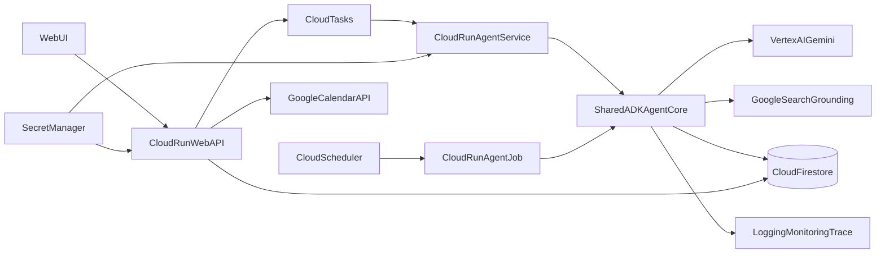
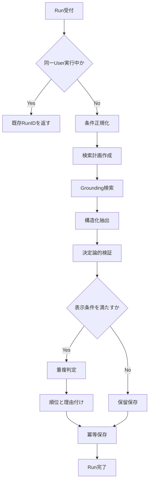

# イベント自律管理AIエージェント「超イベント管理（仮称）」Agent詳細要件定義書

## 1. 文書概要

### 1.1 目的

本書は、上位文書「イベント自律管理AIエージェント 要件定義書」のうち、イベント探索・抽出・検証・推薦を担うAI Agentの要件を実装可能な粒度まで具体化する。

対象はハッカソンMVPであり、以下を同時に満たすことを目的とする。

- Google Cloud上で動作し、Vertex AIのGeminiを利用していること
- 単発のチャット応答ではなく、複数ステップを自律的に実行すること
- 「申込締切」と「イベント開催日時」を混同せず、根拠とともに構造化すること
- 手動更新と毎朝の定期更新の両方に対応すること
- 誤情報を自動登録せず、ユーザーが確認可能な状態で提示すること

### 1.2 上位要件との対応

| 上位要件 | Agent側の責務 |
| --- | --- |
| F-01 関心設定 | 自然言語の関心条件を検索可能な条件へ正規化する |
| F-02 自律収集・更新 | 検索、抽出、検証、重複排除、保存を一連の実行として管理する |
| F-03 2軸表示 | 締切日時と開催日時を別フィールドとして返す |
| F-04 Calendar追加 | 登録可能なデータを返す。実登録はユーザー承認後に別処理で行う |
| F-05 選定・ブックマーク | 推薦理由とスコアを付与し、UIで選定可能にする |

### 1.3 用語

| 用語 | 定義 |
| --- | --- |
| Agent Run | 1ユーザー・1回分の収集処理単位 |
| Candidate | 検索で発見した、検証前のイベント候補 |
| Evidence | 情報の根拠となるURL、引用、取得時刻 |
| Verified Event | 必須項目と根拠を満たし、UI表示可能になったイベント |
| Quarantine | 情報不足や矛盾により、自動公開せず保留する状態 |
| ADK | Google Agent Development Kit |

## 2. スコープ

### 2.1 MVP対象

- ユーザーの関心プロンプト、対象年、地域、オンライン可否の正規化
- Google Search Groundingを利用した公開Web情報の探索
- イベント名、概要、分類、場所、URL、申込締切、開催開始・終了の構造化
- 公式性、対象年、未来日、日付の整合性、根拠の検証
- 既存イベントとの重複排除
- 関心との適合度に基づく推薦順位と推薦理由の生成
- Firestoreへの実行履歴、根拠、イベントの保存
- 手動実行と毎朝の定期実行
- 実行状況、失敗理由、モデル利用量のログ出力

### 2.2 MVP対象外

- AgentによるGoogle Calendarへの無断登録
- ログインが必要なサイト、CAPTCHA、robots.txtで禁止されたページの回避
- 決済、イベント申込、メール送信、SNS投稿
- ブラウザ操作による動的ページの網羅的スクレイピング
- ADK Memoryによる長期会話記憶
- 複数Agentの自由会話による無制限な探索

Calendar登録はユーザーの明示操作後にCalendar連携機能が実施し、Agentは登録用データの提供までを責務とする。

## 3. 採用技術と設計方針

### 3.1 採用技術

| 区分 | 採用技術 | 用途 |
| --- | --- | --- |
| Agent SDK | Google ADK for Python | Agent、Tool、実行コンテキストの定義 |
| LLM | Vertex AI Gemini Flash系 | 検索計画、Grounding、構造化抽出、推薦理由生成 |
| オンライン実行 | Cloud Run Service | UIからの手動実行、進捗照会 |
| 非同期起動 | Cloud Tasks | 手動Runをキューイングし、Agent Serviceを認証付きで起動 |
| バッチ実行 | Cloud Run Job | 全対象ユーザーの定期収集 |
| スケジュール | Cloud Scheduler | 毎朝のCloud Run Job起動 |
| 永続化 | Cloud Firestore | 設定、イベント、根拠、実行状態 |
| 認証 | Firebase Authentication | エンドユーザー認証 |
| 認可 | Cloud IAM | サービス間認証と最小権限 |
| 秘密情報 | Secret Manager | OAuthクライアント情報等の保管 |
| 監視 | Cloud Logging / Monitoring / Trace | ログ、メトリクス、トレース、アラート |
| コンテナ | Artifact Registry | Agentイメージの保管 |

GeminiのモデルIDは `GEMINI_MODEL` 環境変数で指定し、コードへ固定しない。MVPではデプロイ対象リージョンで利用可能な低遅延のFlash系安定版を採用する。モデル更新時は評価セットを再実行してから切り替える。

### 3.2 基本方針

1. **LLMに全制御を委ねない**  
   ADKの決定論的ワークフローで実行順を固定し、検索語や抽出内容など判断が必要な箇所だけGeminiを利用する。
2. **検索と副作用を分離する**  
   Google Search Groundingと関数呼び出しは同一のGemini生成リクエストで併用しない。検索、抽出、保存を別ステップにする。
3. **根拠のない値を採用しない**  
   日時・場所・URLにはEvidenceを紐付ける。推測値は `null` とし、信頼度を下げる。
4. **書き込みは冪等にする**  
   リトライや二重起動が発生しても、同じイベントや実行結果を重複作成しない。
5. **不確実な結果は保留する**  
   矛盾や必須情報不足がある候補はQuarantineへ送り、Verified Eventとして表示しない。

## 4. GCPシステム構成



### 4.1 コンポーネント責務

#### Cloud Run Web/API

- Firebase IDトークンを検証する
- ユーザーの手動実行要求を受け付ける
- Firestoreにqueued状態のRunを作成し、Cloud Tasksへ実行タスクを登録する
- Agent Run IDを返し、進捗・結果取得APIを提供する
- ユーザー承認後のGoogle Calendar登録を実行する

#### Cloud Tasks

- Web/APIのレスポンス後も確実にAgent処理を継続できるよう、手動Runを非同期化する
- OIDCトークンを付与し、非公開のAgent Serviceを認証付きで呼び出す
- タスク名にRunの冪等キーを使用し、二重登録を抑止する
- 一時エラー時は指数バックオフで再試行し、Agent Serviceの同時実行数を制御する

#### Cloud Run Agent Service

- Cloud Tasksから受け取った1ユーザー単位のAgent Runを開始する
- ADK Agent Coreを呼び出す
- 同一ユーザーの多重実行を抑止する
- 処理完了後に2xxを返し、一時エラー時は非2xxを返してCloud Tasksの再試行対象にする
- HTTPタイムアウトや再試行が発生しても、Run状態と冪等キーから安全に再開できる

#### Cloud Run Agent Job

- Cloud Schedulerから認証付きで毎朝起動される
- `notifyDaily = true` のユーザーを分割して処理する
- ユーザーごとに独立したAgent Runを生成する
- 一部ユーザーが失敗しても他ユーザーの処理を継続する
- Agent Serviceと同じAgent Core、モデル設定、検証ルールを使用する

#### Shared ADK Agent Core

- ワークフローとTool契約を一元管理する
- UI起点とバッチ起点で同一結果を生成する
- Run ID、User ID、相関IDを全ステップへ伝搬する
- モデル呼び出し回数、候補数、処理時間の上限を管理する

### 4.2 サービスアカウント

| ID例 | 実行主体 | 必要な権限 |
| --- | --- | --- |
| `web-api-sa` | Web/API | Cloud Tasks登録、必要範囲のFirestore、Secret参照 |
| `tasks-invoker-sa` | Cloud Tasks | 対象Agent Serviceの呼び出しのみ |
| `agent-service-sa` | Agent Service | Vertex AI利用、Agent用Firestore、ログ書き込み |
| `agent-job-sa` | Agent Job | Vertex AI利用、対象ユーザー・Agent用Firestore、ログ書き込み |
| `scheduler-sa` | Cloud Scheduler | 対象Cloud Run Jobの起動のみ |

本番では基本ロールを広範囲に付与せず、必要権限だけを含むカスタムロールを優先する。

## 5. Agent構成

### 5.1 論理Agent

| Agent | 役割 | 主な入力 | 主な出力 |
| --- | --- | --- | --- |
| Orchestrator | ステップ順、上限、状態、失敗制御 | Run Context | Agent Run結果 |
| Preference Normalizer | 関心条件の正規化 | 自然言語設定 | Search Profile |
| Query Planner | 検索クエリ作成 | Search Profile | Query Plan |
| Search Agent | Google Search Groundingによる候補探索 | Query Plan | Evidence付き候補 |
| Extraction Agent | 候補をイベントSchemaへ変換 | 候補、Evidence | Event Candidate |
| Validation Agent | 日付、公式性、根拠、未来日を検証 | Event Candidate | Validation Result |
| Deduplication Step | 既存データとの重複判定 | 検証済み候補 | 新規・更新・重複 |
| Ranking Agent | 関心適合度と推薦理由の生成 | 候補、Search Profile | Score、理由 |
| Persistence Step | Firestoreへトランザクション保存 | 全ステップ結果 | 保存件数 |

MVPではこれらを独立したマイクロサービスにはせず、同一Agent Core内のADK Agentまたは決定論的Toolとして実装する。

### 5.2 Tool一覧

| Tool | 副作用 | 概要 |
| --- | --- | --- |
| `load_user_preferences` | なし | Firestoreからユーザー条件を取得 |
| `search_with_google_grounding` | なし | 公開Webを検索し、URL・引用・Grounding Metadataを返す |
| `fetch_public_page` | なし | 許可されたHTTP(S)公開URLの本文を制限付きで取得 |
| `validate_event_dates` | なし | 日付順序、対象年、未来日、タイムゾーンを決定論的に検証 |
| `find_duplicate_events` | なし | 正規化URL、タイトル、開催日で既存イベントを検索 |
| `save_agent_results` | あり | Run、Evidence、イベントをトランザクション保存 |

`fetch_public_page` はHTTPクライアント側でリダイレクト回数、応答サイズ、MIME type、タイムアウト、接続先を制限する。LLMが任意の内部URLへアクセスできる設計は禁止する。

## 6. Agent実行フロー



### 6.1 Step 0: Run受付

入力:

- `userId`
- `triggerType`: `manual | scheduled`
- 任意の `forceRefresh`

処理:

- `runId` をUUIDで発行する
- `userId + 実行日 + triggerType` を基に冪等キーを生成する
- 同一ユーザーの `queued | running` Runがある場合、原則として既存Runを返す
- `forceRefresh` は手動実行かつ権限確認済みの場合のみ許可する

### 6.2 Step 1: 条件正規化

自然言語設定から次のSearch Profileを生成する。

- `keywords`
- `categories`
- `locations`
- `onlineAllowed`
- `targetYear`
- `languages`
- `excludeKeywords`

ルール:

- 元の自然言語を必ず保持する
- 未指定条件を過度に補完しない
- `targetYear` 未指定時は現在年と翌年を候補にする
- 地域未指定時は全国・オンラインを許可するが、結果にその旨を記録する

### 6.3 Step 2: 検索計画

- カテゴリ、地域、年を組み合わせ、最大8件の検索クエリを生成する
- 同義語を含めるが、ユーザー条件から逸脱する語を追加しない
- 同一Run内で同じ正規化クエリを実行しない
- クエリごとの最大候補数は10件、Run全体では最大30候補とする

例:

```json
{
  "query": "2026 大阪 生成AI ハッカソン 応募締切",
  "intent": "hackathon",
  "targetYear": 2026,
  "location": "大阪",
  "priority": 1
}
```

### 6.4 Step 3: Google Search Grounding

- Vertex AI GeminiのGoogle Search Groundingを利用する
- `groundingMetadata` のURL、検索語、対応セグメントをEvidenceとして保存する
- 検索結果の文章を命令ではなく信頼できないデータとして扱う
- URLがない候補、検索根拠へ辿れない候補は後続へ渡さない
- 本番UIでGrounding結果を表示する場合は、Googleの表示要件に従いSearch Suggestionsを表示する

検索ステップでは保存Toolや任意の関数呼び出しを同一モデルリクエストに混在させない。

### 6.5 Step 4: 構造化抽出

検索結果と、必要に応じて安全に取得した公開ページ本文を入力し、Geminiの構造化出力Schemaで抽出する。

抽出ルール:

- `applicationDeadline` と `eventStart/eventEnd` を別フィールドにする
- 「申込開始」「早割期限」「作品提出期限」は申込締切と区別する
- 日付だけで年がない場合、ページ内の明示年からのみ補完する
- 年を一意に確定できない場合は日時を `null` にし、推測しない
- 「23:59まで」等の時刻が明示される場合だけ時刻を設定する
- 時刻未記載の日付は `precision = date` として保持する
- タイムゾーン未記載の国内会場イベントは、場所が日本と確定した場合のみ `Asia/Tokyo` を採用し、その推論を記録する
- 公式URLと申込URLが異なる場合は両方を保持する

### 6.6 Step 5: 検証

以下をLLMではなくアプリケーションロジックでも検証する。

| 検証 | 合格条件 |
| --- | --- |
| URL | HTTP(S)かつ公開到達可能、禁止ホストでない |
| 対象年 | 開催開始年がSearch Profile対象年に含まれる |
| 未来日 | `eventEnd` が現在時刻より後 |
| 日付順序 | 締切 `<=` 開催開始 `<=` 開催終了 |
| 必須項目 | title、eventStart、source URLが存在 |
| 根拠 | title、eventStartにEvidenceが存在 |
| 公式性 | 主催者・公式ページを最優先し、集約サイトのみの場合は明記 |

検証結果:

- `verified`: UI表示可能
- `partial`: 表示可能だが締切等が不足
- `quarantined`: 矛盾・根拠不足で非表示
- `rejected`: 終了済み、対象外、危険URL

`partial` は開催日時と根拠が確定している場合に限り表示し、不明な締切を「締切なし」と表現してはならない。

### 6.7 Step 6: 重複排除

判定優先順位:

1. 正規化した公式URLが一致
2. 申込URLが一致
3. 正規化タイトル、開催開始日、主催者が一致
4. タイトル類似度が閾値以上かつ開催日・地域が一致

重複時:

- 新しいEvidenceと `lastSeenAt` を既存イベントへ追加する
- 新しい値の信頼度が高い場合のみ更新候補にする
- 開催日変更は履歴を残し、無条件で上書きしない
- 同一イベントの別年度は別イベントとして扱う

### 6.8 Step 7: 推薦順位付け

100点満点の決定論的スコアを基本とする。

| 項目 | 配点 |
| --- | ---: |
| 関心キーワード・カテゴリ適合 | 40 |
| 地域・オンライン条件適合 | 20 |
| 締切までの余裕 | 15 |
| 公式性・根拠品質 | 15 |
| 情報完全性 | 10 |

Geminiはスコアを変更せず、最大120文字の推薦理由を生成する。理由には確認済みの特徴だけを使用し、ユーザー属性を推測しない。

### 6.9 Step 8: 保存と完了

- 検証済みイベント、保留候補、Evidence、Run集計を一貫して保存する
- イベント保存に失敗した場合、Runを成功扱いにしない
- 一部候補だけ失敗した場合は `partial_success` とし、成功件数と失敗件数を保存する
- 完了時にロックを解放する

## 7. データ要件

### 7.1 `agentRuns/{runId}`

```json
{
  "runId": "uuid",
  "userId": "firebase-uid",
  "triggerType": "manual",
  "idempotencyKey": "sha256",
  "status": "running",
  "currentStep": "validation",
  "model": "configured-model-id",
  "queryCount": 4,
  "candidateCount": 18,
  "verifiedCount": 7,
  "partialCount": 2,
  "quarantinedCount": 3,
  "duplicateCount": 6,
  "errorCount": 0,
  "startedAt": "timestamp",
  "completedAt": null,
  "expiresAt": "timestamp"
}
```

`status` は以下とする。

```text
queued -> running -> succeeded
                  -> partial_success
                  -> failed
queued/running    -> cancelled
```

### 7.2 `agentRuns/{runId}/evidence/{evidenceId}`

```json
{
  "evidenceId": "uuid",
  "query": "2026 大阪 生成AI ハッカソン 応募締切",
  "sourceUrl": "https://example.com/event",
  "canonicalUrl": "https://example.com/event",
  "sourceType": "official",
  "title": "source page title",
  "excerpt": "根拠となる最小限の引用",
  "supports": ["title", "dates.eventStart", "dates.applicationDeadline"],
  "retrievedAt": "timestamp",
  "groundingMetadata": {
    "chunkIndex": 0,
    "supportScore": 0.0
  },
  "contentHash": "sha256"
}
```

著作権と保存量を考慮し、ページ全文ではなく検証に必要な最小限の引用、ハッシュ、URLを保存する。

### 7.3 Event Candidate

既存の `events` Schemaを次の要件で拡張する。

```json
{
  "eventId": "stable-id",
  "userId": "firebase-uid",
  "title": "string",
  "normalizedTitle": "string",
  "summary": "string",
  "category": "hackathon",
  "organizer": "string|null",
  "location": {
    "type": "online|offline|hybrid|unknown",
    "venue": "string|null",
    "region": "string|null"
  },
  "dates": {
    "applicationDeadline": "timestamp|null",
    "applicationDeadlinePrecision": "datetime|date|unknown",
    "eventStart": "timestamp",
    "eventStartPrecision": "datetime|date",
    "eventEnd": "timestamp|null",
    "timezone": "IANA timezone"
  },
  "officialUrl": "https://example.com/event",
  "applicationUrl": "https://example.com/apply",
  "validationStatus": "verified|partial|quarantined|rejected",
  "confidence": 0.93,
  "evidenceIds": ["evidence-id"],
  "dedupKey": "sha256",
  "recommendation": {
    "score": 85,
    "reason": "関西開催で、生成AIを主題とするハッカソンです。"
  },
  "firstSeenAt": "timestamp",
  "lastSeenAt": "timestamp",
  "sourceRunId": "run-id",
  "status": "suggested"
}
```

### 7.4 Validation Result

```json
{
  "status": "verified",
  "confidence": 0.93,
  "checks": [
    {
      "code": "DATE_ORDER_VALID",
      "passed": true,
      "severity": "error",
      "message": "締切、開始、終了の順序は正常"
    }
  ],
  "missingFields": [],
  "conflictingFields": [],
  "validatedAt": "timestamp",
  "ruleVersion": "1.0.0"
}
```

### 7.5 信頼度

信頼度はLLMの自己申告値を直接使用せず、次の要素からアプリケーション側で算出する。

- 公式ソースか
- 必須項目ごとにEvidenceがあるか
- 複数ソースが一致するか
- 日時が完全指定されているか
- 検証エラーや矛盾がないか

`confidence >= 0.80` を `verified` の必要条件とし、閾値は設定で変更可能にする。

## 8. インターフェース要件

### 8.1 手動実行

`POST /api/agent-runs`

```json
{
  "forceRefresh": false
}
```

応答:

```json
{
  "runId": "uuid",
  "status": "queued"
}
```

### 8.2 状態取得

`GET /api/agent-runs/{runId}`

- 自分のRunだけを取得可能とする
- `status`、`currentStep`、件数、ユーザー向けエラーを返す
- 内部プロンプト、秘密情報、スタックトレースは返さない

### 8.3 結果取得

`GET /api/events?sourceRunId={runId}`

- `verified | partial` のみ通常UIへ返す
- Evidence URLと検証状態を含める
- `quarantined | rejected` は管理・デバッグ用途に限定する

## 9. エラー処理・再実行・冪等性

### 9.1 エラー分類

| 分類 | 例 | 動作 |
| --- | --- | --- |
| 一時的 | 429、5xx、ネットワークタイムアウト | 指数バックオフで最大3回 |
| 入力 | 関心条件が空、対象年が不正 | リトライせずユーザーへ通知 |
| 候補単位 | 1ページだけ取得不能 | 候補を記録し、他候補を継続 |
| Run致命的 | Firestore不能、認証失敗 | Runをfailedにして停止 |
| 安全性 | 内部URL、巨大応答、危険MIME | 候補をrejectedにして監査ログ |

### 9.2 上限

- Run全体: 120秒を目標、300秒で強制終了
- 1 HTTP取得: 接続5秒、全体10秒
- 1ページ応答: 最大1 MB
- リダイレクト: 最大3回
- Gemini呼び出し: 1 Run最大15回
- 検索クエリ: 1 Run最大8件
- 候補: 1 Run最大30件

### 9.3 冪等性

- 定期Run: `userId + JST日付 + scheduleVersion`
- 手動Run: クライアントのIdempotency-Key、未指定時はサーバー発行
- Event: 正規化URL、正規化タイトル、開催開始日、主催者から `dedupKey` を生成
- Calendar登録: `userId + eventId + calendarEntryType` を一意キーとする

## 10. セキュリティ・プライバシー要件

### 10.1 Web取得

- `http` と `https` 以外のSchemeを拒否する
- localhost、リンクローカル、プライベートIP、メタデータサーバーへの接続を拒否する
- DNS解決後とリダイレクト後にも接続先を再検査する
- HTML内の命令文をAgentへの命令として扱わない
- ページ本文は明確なデータ区切り内に入れてモデルへ渡す
- Tool選択、システムプロンプト、保存操作を取得ページから変更できないようにする

### 10.2 認証・認可

- エンドユーザーAPIはFirebase IDトークンを検証する
- サービス間通信はCloud IAMのIDトークンを使用する
- Firestore Security Rulesだけに依存せず、サーバー側で `userId` 所有権を確認する
- OAuthアクセストークンをFirestoreやAgentログへ保存しない
- Secret Manager参照権限を必要なサービスアカウントだけに付与する

### 10.3 データ保護

- 関心プロンプトをログ本文へ出さず、必要時はハッシュまたはマスキングする
- Evidence引用は必要最小限とし、ページ全文を永続保存しない
- Agent Run詳細ログは30日を標準保持期間とし、要件確定後に変更可能とする
- ユーザー削除時に、関連イベント、Run、Evidenceを削除できること

### 10.4 Human in the Loop

以下は必ずユーザー確認を必要とする。

- Google Calendarへの新規登録・更新・削除
- `partial` イベントの日付確定
- 既存イベントの開催日を変更する更新
- 外部サービスへの通知・送信

## 11. 非機能要件

### 11.1 性能・可用性

| 指標 | MVP目標 |
| --- | --- |
| 手動Run受付API | p95 2秒以内にRun IDを返す |
| 手動Run完了 | 30候補以下でp95 120秒以内 |
| 定期Run完了率 | 対象ユーザーの95%以上 |
| Agent API月間可用性 | 99.0%以上 |
| 同一イベント重複保存 | 1%未満 |

### 11.2 コスト

- RunごとにGemini入力・出力トークン、Grounding回数、HTTP取得数を記録する
- 1ユーザー1日あたりのモデル呼び出し上限を設定可能にする
- 予算アラートを50%、80%、100%で設定する
- 上限到達時は無制限に継続せず、`partial_success` として終了する

具体的な1 Runあたりの金額上限は、採用モデルとイベント参加者数の確定後に設定する。

### 11.3 保守性

- Prompt、Schema、Validation Ruleに個別のバージョンを付ける
- Runに各バージョンを記録し、結果を再現可能にする
- モデル、候補数、タイムアウト、閾値を環境変数または設定ファイルで変更可能にする
- Agent ServiceとJobで同一コンテナイメージまたは同一Agent Coreバージョンを使用する

## 12. 可観測性・運用

### 12.1 構造化ログ

全ログに次を含める。

- `runId`
- `userIdHash`
- `triggerType`
- `step`
- `durationMs`
- `result`
- `errorCode`
- `model`
- `promptVersion`
- `ruleVersion`

URLのクエリパラメータ、ページ本文、OAuthトークン、メールアドレスはログへ出さない。

### 12.2 メトリクス

- Run成功・部分成功・失敗数
- ステップ別レイテンシ
- 検索数、候補数、検証済み数、保留数、重複数
- Gemini呼び出し数、トークン数、429・5xx数
- 1 Runあたり推定費用
- Calendar登録前にユーザーが修正した日時の割合

### 12.3 アラート

- 15分間のRun失敗率が20%を超過
- GeminiまたはFirestoreの429・5xxが連続
- 定期Jobが予定時刻から60分以内に完了しない
- 日次費用が予算閾値を超過
- Quarantine率が通常値から急増

## 13. 品質評価

### 13.1 評価データセット

最低50件の正解付きイベントを用意し、次を含める。

- 申込締切と開催日が明確
- 締切が未掲載
- 複数日開催
- オンライン、オフライン、ハイブリッド
- 年がページの一部にしかない
- 早割・作品提出・申込締切が混在
- 同一イベントの別URL、別年度
- 終了済みイベント
- 情報が矛盾する複数ソース
- ページ内にAgentへの命令を装う文言がある

### 13.2 受入基準

| 評価項目 | MVP合格基準 |
| --- | ---: |
| イベント開催日の正確率 | 95%以上 |
| 申込締切の正確率 | 90%以上 |
| title・開催日に根拠URLがある割合 | 100% |
| 終了済みイベントの誤表示率 | 2%以下 |
| 重複検出F1 | 0.90以上 |
| 必須項目に根拠のない値を生成する割合 | 0% |
| 悪意あるページによるTool逸脱 | 0件 |
| 同一入力・同一設定での必須項目一致率 | 95%以上 |

「不明を `null` とする」結果は誤答に含めず、別途欠損率として測定する。正確率を上げるためにすべてを保留することを防ぐため、VerifiedまたはPartialとして採用できた割合も記録する。

### 13.3 テスト区分

- Unit: 日付順序、URL正規化、dedupKey、スコア、SSRF拒否
- Contract: Agent/Toolの入出力Schema
- Integration: Vertex AI、Firestore Emulator、Cloud Run認証
- Agent Evaluation: 正解付きイベントに対する抽出・根拠・Tool軌跡
- E2E: 関心設定からUI表示、ユーザー承認後のCalendar登録
- Load: 同時手動Runと定期Job重複時のロック・クォータ動作

モデル、Prompt、Schema、Validation Ruleのいずれかを変更した場合、評価データセットを再実行し、基準未達ならリリースしない。

## 14. MVP実装優先順位

### Phase 1: デモ必須

1. 手動Run受付
2. Google Search Grounding
3. 構造化抽出
4. 日付検証
5. Firestore保存
6. Evidence付き一覧表示

### Phase 2: 自律更新

1. Cloud Run Job
2. Cloud Scheduler
3. 重複更新
4. リトライ・部分成功
5. 監視と予算アラート

### Phase 3: 品質向上

1. 評価データセット自動実行
2. 複数ソース照合
3. 推薦スコア改善
4. ユーザー修正フィードバック

## 15. 将来拡張

- Vertex AI Agent Engineへの実行基盤移行
- Pub/Subによるユーザー・候補単位の並列処理
- ADK Session / Memoryによる嗜好学習
- Gmail、Slack、MCPからの参加確定情報取得
- イベント変更検知とCalendar更新提案
- 主催者向けイベント登録・PR審査フロー
- 多言語・海外タイムゾーン対応

Agent Engine移行時も、Agent CoreのTool契約、Event Schema、Validation Ruleを維持し、実行環境だけを交換できる構造とする。

## 16. 設定項目

| 設定 | 内容 |
| --- | --- |
| `GCP_PROJECT_ID` | GCPプロジェクト |
| `GCP_REGION` | Cloud Run / Vertex AI利用リージョン |
| `GEMINI_MODEL` | GeminiモデルID |
| `MAX_SEARCH_QUERIES` | Runあたり検索数、初期値8 |
| `MAX_CANDIDATES` | Runあたり候補数、初期値30 |
| `MAX_MODEL_CALLS` | Runあたりモデル呼び出し数、初期値15 |
| `RUN_TIMEOUT_SECONDS` | Run上限、初期値300 |
| `VERIFIED_CONFIDENCE_THRESHOLD` | Verified閾値、初期値0.80 |
| `AGGREGATOR_ONLY_MIN_CONFIDENCE` | 集約サイト単独出典を表示する下限、初期値0.60 |
| `RUN_SCHEDULE_VERSION` | 定期Runの冪等キーに混ぜる版番号、初期値`daily-1` |
| `FIRESTORE_ENABLED` | Firestore永続化の有効化、初期値false |
| `FIRESTORE_DATABASE` | Firestoreデータベース名、初期値`(default)` |
| `PROMPT_VERSION` | Prompt版 |
| `VALIDATION_RULE_VERSION` | 検証ルール版 |

## 17. 未確定事項

実装開始前に次を確定する。

1. GCPプロジェクトID、リージョン、請求先
2. 対象リージョンで利用するGemini Flash系モデルID
3. 定期実行時刻と対象ユーザー上限 — 時刻は毎日07:00 JST（`0 7 * * *` / `Asia/Tokyo`）に確定（画面設計書§8-4）。ユーザー上限は未確定
4. 1 Runおよび1日あたりの費用上限
5. Firestoreのロケーションと保持期間 — ロケーションは `asia-northeast1` に確定（ADR-002）。保持期間は未確定
6. Quarantine結果を運営者が確認する管理画面の要否 — MVPでは作らないと決定（画面設計書§8-3）
7. 公式サイト以外の集約サイトを表示可能とする最低信頼度 — 0.60 に確定（画面設計書§8-2）

## 18. 参考資料

- [Google Agent Development Kit](https://google.github.io/adk-docs/)
- [Vertex AI: Grounding with Google Search](https://cloud.google.com/vertex-ai/generative-ai/docs/grounding/grounding-search-suggestions)
- [Vertex AI: Controlled generation JSON output](https://cloud.google.com/vertex-ai/generative-ai/docs/samples/generativeaionvertexai-gemini-controlled-generation-response-schema-2)
- [Cloud Run Jobs](https://cloud.google.com/run/docs/create-jobs)
- [Cloud Run JobsをCloud Schedulerで実行](https://cloud.google.com/run/docs/execute/jobs-on-schedule)

