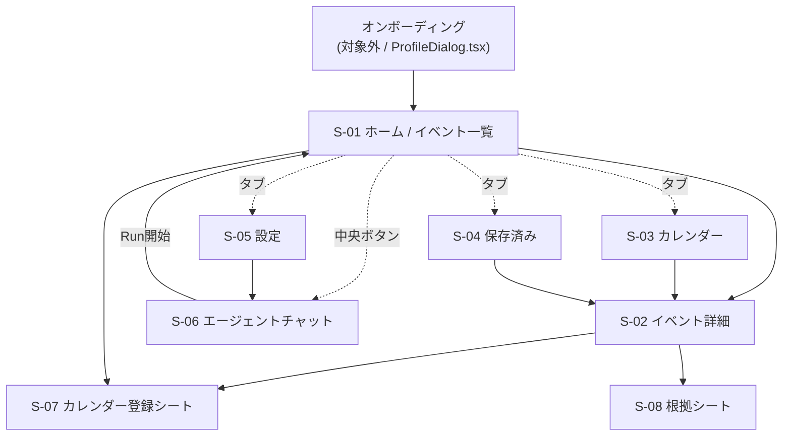

# 超イベント管理（仮称）スマートフォン画面設計書

| 項目 | 内容 |
| --- | --- |
| 版 | 1.0.0 |
| 対象 | スマートフォン（縦持ち）。基準幅 360px、検証幅 390×844 / 360×800 |
| 上位文書 | [プロジェクト要件定義書](./イベント自律管理AIエージェント%20要件定義書.md) / [Agent詳細要件定義書](./Agent詳細要件定義書.md) |
| モック | [docs/mockups/mobile.html](./mockups/mobile.html) |
| 対象外 | オンボーディング画面（`apps/web/src/ProfileDialog.tsx` を正とする）、タブレット・PC専用レイアウト、管理者向けQuarantine確認画面 |

本書での「§x」は、特記ない限り [Agent詳細要件定義書](./Agent詳細要件定義書.md) の章番号を指す。上位要件定義書を参照する場合は「上位§x」と書く。

---

## 1. 設計の前提

### 1.1 このプロダクトが画面で解かねばならないこと

上位§1.1 が挙げる課題のうち、画面設計が直接引き受けるのは次の3つ。

1. **2つの日程の混同** — 「申込締切日」と「イベント開催日」を、ひと目で別物と分かる形で出す。
2. **選定の負荷** — 推薦理由と根拠を添えて、判断に必要な情報をカード内で完結させる。
3. **カレンダー転記の二度手間** — 締切・本番・両方を1操作で登録できる導線を置く。

### 1.2 実装レベルの前提（ハッカソンMVP）

| 項目 | 本設計での扱い |
| --- | --- |
| Googleログイン | **モック**。設定画面に接続済み表示を持つが認証は行わない |
| Googleカレンダー登録 | **モック**。確認ダイアログまで実装し、確定ハンドラのみ差し替え可能にする |
| Agent実行 | 実API（`POST /api/agent-runs` → `GET /api/agent-runs/{runId}`）。§14 Phase 1 のデモ必須範囲 |
| 根拠（Evidence）表示 | 画面は設計する。取得APIは未実装のため §8 の未決事項に記載 |

### 1.3 現状のコードとの差分

本書は既存実装を置き換える前提で書いている。着手時点（コミット `926f8d8` + 復元コミット）の `apps/web` は次の状態にある。

| 項目 | 現状 | 本設計 |
| --- | --- | --- |
| レイアウト | `app-shell` + `sidebar` のデスクトップ2カラム（`App.tsx` 371行） | 下部タブバー + 1カラム |
| 画面切替 | `useState<'today' \| 'calendar'>` で `hidden` 属性を出し分け。履歴を持たないため端末の戻る操作が効かない | ルータ経由（§6.1） |
| 「保存したイベント」 | `href="#"` のまま遷移しない | S-04 として実装 |
| エージェント対話 | `AgentChat.tsx` は存在するが `App.tsx` から使われておらず、UIから到達できない | S-06 として復帰 |
| データ | `App.tsx` 内のローカル定数。`api/client.ts` を呼んでいない | `listEvents()` 経由 |
| メディアクエリ | 900px / 680px / 480px の下向き3本（480pxはプロフィールダイアログ専用） | モバイルファーストに反転（§5.3） |
| デザイントークン | `:root` の10トークンは本書 §5.1 と一致 | 維持して追加（§5.2） |

`components/AgentChat.tsx`、`components/RoutePanel.tsx`、`api/client.ts`、`types/api.ts`、`data/events.ts` はマージ事故で一度失われ、復元済み。現在はどれも `App.tsx` から参照されていないため、本設計の実装時に接続し直す。

### 1.4 レイアウト方針

- **モバイルファースト**。ベースCSSを360px幅前提で書き、`@media (min-width: 480px)` で `max-width: 420px` のコンテナに閉じる。PCでは中央に狭幅で表示する。
- 1カラム固定。横スクロールは発生させない。
- 下部タブバーは固定。コンテンツ下端に `calc(var(--tab-h) + env(safe-area-inset-bottom))` の余白を確保し、iOSのホームバーに被らせない。
- タップターゲットは最小 44×44px。

---

## 2. 情報アーキテクチャ

### 2.1 下部タブバー

5スロット。中央のみ隆起させてエージェントの起動に充てる。

| スロット | ラベル | 画面 | 対応機能ID |
| --- | --- | --- | --- |
| 1 | ホーム | S-01 | F-02, F-03 |
| 2 | カレンダー | S-03 | F-03 |
| 3（中央・隆起） | エージェント | S-06 | F-01, F-02 |
| 4 | 保存済み | S-04 | F-05 |
| 5 | 設定 | S-05 | F-01 |

**エージェントをタブバー中央に置く理由**: デスクトップ版はサイドバーにチャットを常駐させているが、スマホでサイドバーは成立しない。F-01（関心設定）とF-02（自律収集）はこのプロダクトの差別化点そのもので、§14 Phase 1「デモ必須」の入口にあたるため、常時1タップで届く位置に置く必要がある。右下FABにするとイベント一覧のスクロールとカードのアクションに被るため、タブバーの中央スロットを隆起させる形を採る。

### 2.2 画面一覧

| 画面ID | 名称 | 種別 | 対応機能ID |
| --- | --- | --- | --- |
| S-01 | ホーム / イベント一覧 | タブ | F-02, F-03, F-04, F-05 |
| S-02 | イベント詳細 | プッシュ遷移 | F-03, F-04, F-05 |
| S-03 | カレンダー（2軸月表示） | タブ | F-03 |
| S-04 | 保存済み | タブ | F-05 |
| S-05 | 設定 | タブ | F-01 |
| S-06 | エージェントチャット | フルスクリーンシート | F-01, F-02 |
| S-07 | カレンダー登録シート | ボトムシート | F-04 |
| S-08 | 根拠（Evidence）シート | ボトムシート | — （§6.4, §7.2） |

Agent Run の進捗は独立した画面にしない。Runは最大120秒かかり（§9.2）、チャットを閉じても進捗を追えなければならないため、**S-01上部の進捗バナー状態**として設計する。

### 2.3 画面遷移



---

## 3. 全画面共通の表示ルール

ここで決めたルールは各画面仕様より優先する。要件由来の禁止事項を含むため、実装時に画面単位で崩してはならない。

### 3.1 検証ステータス（§6.6, §8.3）

| `validationStatus` | 表示 | 色トークン | 補足 |
| --- | --- | --- | --- |
| `verified` | ✓ 公式情報で確認済み | `--verified` | — |
| `partial` | △ 一部未確認 | `--partial` | **不足項目を必ず併記**する（例「申込締切が未確認です」） |
| `quarantined` | **表示しない** | — | §8.3 により通常UIへ返さない |
| `rejected` | **表示しない** | — | 同上 |

`partial` は「開催日時と根拠が確定している場合に限り表示する」（§6.6）。一覧・カレンダー・保存済みのいずれでも `verified` と見分けがつく状態にする。

### 3.2 日付表示

| 条件 | 表示 |
| --- | --- |
| `dates.applicationDeadline === null` | **「未確認」** |
| `dates.applicationDeadlinePrecision === 'date'` | 日付のみ。時刻を出さない |
| `dates.applicationDeadlinePrecision === 'datetime'` | 日付 + 時刻 |
| `dates.eventEnd` が `eventStart` と異なる | 「M月D日 — M月D日」 |
| `dates.eventEnd === null` または同日 | 「M月D日」 |

**禁止事項**: 締切が不明なイベントを「締切なし」「締切自由」等と表現してはならない（§6.6）。必ず「未確認」と書く。既存の `apps/web/src/data/events.ts` の `formatDateLabel()` は `null` に対して `'未確認'` を返す実装になっているため、これを流用する。

日付はすべて `dates.timezone`（既定 `Asia/Tokyo`）で解釈して表示する。

### 3.3 デュアル日付ブロック（上位§5-1）

一覧カード・詳細・保存済みで共通の部品にする。デスクトップ版の `.event-dates`（2カラム横並び + `.date-connector`）は360px幅に収まらないため、**縦2段の左ボーダー行**に変える。

| 行 | 左ボーダー | アイコン | ラベル | 値 | 補助 |
| --- | --- | --- | --- | --- | --- |
| 上 | `--deadline` 4px | 🚨 | 申込締切 | `dates.applicationDeadline` | `あとN日` |
| 下 | `--event` 4px | 📅 | 開催日 | `dates.eventStart`〜`dates.eventEnd` | `N日後` |

2行のあいだに「この間に N 日」を小さく置き、2つの日程が別物であることを縦方向の距離でも示す。

差別化は色に依存させない。次の6軸のうち**4軸がグレースケールでも生き残る**構成にする。上位§5-1の目的は混同防止であり、色だけに頼ると色覚特性のあるユーザーで目的を達成できない。

| 差別化の軸 | 申込締切 | 開催日 | 白黒で生存 |
| --- | --- | --- | :---: |
| 縦位置 | 常に上 | 常に下 | ○ |
| ノード形状 | ● 塗り円 | ■ 角丸四角 | ○ |
| アイコン | 🚨 | 📅 | ○ |
| ラベル文字 | 「申込締切」 | 「開催日」 | ○ |
| 左ボーダー色 | `--deadline` | `--event` | × |
| 背景色 | `--deadline-soft` | `--event-soft` | × |

さらに相対日の文字ウェイトに差をつける（締切「あと3日」は太字・`--deadline`、開催「20日後」は通常・`--muted`）。締切のほうが行動を要する情報だからである。

検証方法は §9 のチェックリスト5番（グレースケール表示で判別できるか）。モックには白黒確認トグルを用意する。

### 3.4 ステータスバッジ（上位§5-3）

カード右上に**1個だけ**出す。複数該当する場合の優先順位は次のとおり。

1. `締切間近`（締切まで5日以内。`--deadline`）
2. `カレンダー登録済み`（`--event`）
3. `未登録`（`--muted`）

締切が `null` のイベントは `締切間近` にならない（判定できないため）。

### 3.5 Agent Run の進捗表示

`POST /api/agent-runs` の後、既存の `pollAgentRun()`（`apps/web/src/api/client.ts`）で `currentStep` を取得する。生の識別子をそのまま出さず、次の表で日本語に変換する。識別子はバックエンド `services/agent/src/event_agent/workflows/collect.py` の実装値。

| `currentStep` | 表示 | 進捗 |
| --- | --- | --- |
| `queued` | 受け付けました | 0 / 8 |
| `normalize` | 関心条件を整理しています | 1 / 8 |
| `plan` | 検索計画を作成しています | 2 / 8 |
| `search` | Webを検索しています | 3 / 8 |
| `extract_validate` | 日程を抽出・検証しています | 4 / 8 |
| `dedupe` | 重複を整理しています | 5 / 8 |
| `rank` | おすすめ順に並べています | 6 / 8 |
| `save` | 保存しています | 7 / 8 |
| `completed` | 完了しました | 8 / 8 |
| `failed` | 取得に失敗しました | — |

`status` 別の扱い:

| `status` | 表示 |
| --- | --- |
| `succeeded` | 「N件のイベントを更新しました」 |
| `partial_success` | 「N件を更新しました（一部は取得できませんでした）」。**失敗扱いにしない** |
| `failed` | `errorMessage` を出す。内部プロンプト・スタックトレースは出さない（§8.2） |
| `cancelled` | 「中止しました」 |

待ち時間中も一覧の閲覧を妨げない（バナーは非モーダル）。Runは最大120秒かかるため、進捗は**経過時間ではなくステップ番号で駆動**する（偽の残り時間を出さない）。

**既知の不整合（実装時に直す）**: `apps/web/src/api/client.ts` の `pollAgentRun` の既定タイムアウトは **120秒**だが、§9.2 / §16 の `RUN_TIMEOUT_SECONDS` は **300秒**。120秒は §11.1 の p95 目標値であり上限ではないため、現状では p95 を外れたRunでサーバがまだ実行中なのにクライアントだけが例外を投げる。対応:

- 既定タイムアウトを 180 秒へ引き上げる
- タイムアウトを**エラーとして扱わない**。「まだ実行中です。しばらくしてから再確認してください」+ 状態再取得ボタンにする
- ポーリング間隔が 1200ms 固定（`client.ts`）で120秒に約100リクエストになるため、段階的バックオフ（1秒×10回 → 2秒×15回 → 5秒）にする

### 3.6 外部リンク

`officialUrl` と `applicationUrl` が異なる場合は**両方を出す**（§6.5）。同じ場合は1つにまとめる。外部遷移は `rel="noopener noreferrer"` を付ける。

### 3.7 Google Search Suggestions の表示義務（§6.4）

この義務が生じるのは**Groundingの生成文をそのまま画面に出す箇所だけ**である。切り分け:

| 画面 | 描画しているもの | 表示義務 |
| --- | --- | --- |
| S-01 / S-02 / S-03 / S-04 / S-08 | 抽出・検証を通した**正規化済み構造化フィールド**（`title`、`dates.*`、`summary` 等） | **生じない** |
| S-06 エージェントチャット | `ChatResponse.reply`（Groundingを経た生成文） | **生じる** |

したがって S-06 のエージェント発言バブルの**直下**に Search Suggestions のスロットを確保する。

- Googleが返すHTML（`groundingMetadata.searchEntryPoint.renderedContent`）を**無改変で**挿入する。再スタイル・切り抜き・折りたたみ・非表示は禁止
- 高さを予約する（`min-height: 44px`、全幅）。後から差し込むとレイアウトが跳ねる
- `ChatResponse` に `searchSuggestionsHtml?: string` を追加する必要がある（§7 の契約ギャップ6）
- 将来 S-01 / S-02 に「AIの補足コメント」等の生成文を追加する場合、**その画面にも同じウィジェットが必要になる**。生成文を足すときは必ずこの節に戻ること
- モックにも「Search Suggestions 表示位置（Google提供HTMLを無改変で挿入）」のプレースホルダ枠を置く。ここを省くと実装時に義務を落としたまま出荷される

---

## 4. 画面仕様

各画面は次の構成で記述する。「表示データ」列のフィールドパスは `apps/web/src/types/api.ts` の型に実在するものだけを使う。

### S-01 ホーム / イベント一覧

| 項目 | 内容 |
| --- | --- |
| 画面ID | S-01 |
| 目的 | 締切が迫っているものを取り逃がさせない。関心に近い順でイベントを選べるようにする |
| 対応機能ID | F-02, F-03, F-04, F-05 |
| 種別 | タブ1 |

**レイアウト構成（上→下）**

1. ヘッダ: 今日の日付 / 画面タイトル / 「イベントを更新」ボタン
2. Agent進捗バナー（Run実行中のみ表示。§3.5）
3. 締切カウントダウンカード: 直近の締切までの日数と対象イベント名
4. フィルタチップ: すべて / 締切間近 / オンライン可
5. イベントカードの1カラムリスト

**表示データ項目**

| UI要素 | フィールドパス | 未設定時 |
| --- | --- | --- |
| カードタイトル | `event.title` | — （必須項目。§6.6） |
| 主催者 | `event.organizer` | 「主催者未確認」 |
| カテゴリタグ | `event.category` | 非表示 |
| 適合度 | `event.recommendation.score` | 非表示 |
| 推薦理由 | `event.recommendation.reason` | 非表示 |
| 概要 | `event.summary` | 非表示 |
| 申込締切 | `event.dates.applicationDeadline` | **「未確認」**（§3.2） |
| 開催日 | `event.dates.eventStart` / `event.dates.eventEnd` | — （必須項目） |
| 開催場所 | `event.location.venue` → `event.location.region` | 「場所未確認」 |
| 開催形式 | `event.location.type` | 「形式未確認」 |
| 検証バッジ | `event.validationStatus` | §3.1 |
| 保存状態 | `event.status === 'bookmarked'` | 未保存 |

**状態**

| 状態 | 表示 |
| --- | --- |
| 初期 | 直近のRun結果（`GET /api/events`）を表示 |
| ローディング | カードのスケルトンを3枚 |
| 空（Run未実行） | 「まだイベントがありません」+ エージェント起動を促すボタン |
| 空（フィルタ結果0件） | 「条件に合うイベントがありません」+ フィルタ解除ボタン |
| エラー | 取得失敗メッセージ + 再試行ボタン。内部情報は出さない（§8.2） |
| 部分成功 | 一覧は出したうえで、バナーに「一部は取得できませんでした」 |

**主要操作と遷移先**

| 操作 | 遷移・結果 |
| --- | --- |
| カードをタップ | S-02 イベント詳細 |
| ♡ をタップ | `status` を `bookmarked` / `suggested` にトグル |
| カレンダーボタン | S-07 カレンダー登録シート |
| 「イベントを更新」 | `POST /api/agent-runs` → 進捗バナー表示 |
| 中央タブ | S-06 エージェントチャット |

**要件由来の制約**

- `quarantined` / `rejected` は表示しない（§8.3）
- 終了済みイベント（`dates.eventEnd < 現在`）は一覧に出さない。§13.2 の「終了イベント誤表示 ≤2%」に直結する
- 並び順は `recommendation.score` の降順（§6.8 の決定論的スコア）。クライアント側でスコアを再計算しない

> **実装メモ**: 「イベントを更新」は、かつて `document.querySelector('.chat-refresh')?.click()` でチャット側のボタンを叩く実装だった（現在は解消済み）。この暗黙結合は持ち込まず、Run開始状態を親で持ってヘッダとチャットの双方から参照する。`§9` の `grep querySelector` が0件であることを維持する。

---

### S-02 イベント詳細

| 項目 | 内容 |
| --- | --- |
| 画面ID | S-02 |
| 目的 | 申し込むかどうかを、根拠を確認したうえで判断できるようにする |
| 対応機能ID | F-03, F-04, F-05 |
| 種別 | プッシュ遷移（S-01 / S-03 / S-04 から） |

**レイアウト構成（上→下）**

1. ヘッダ: 戻る / 共有
2. タイトル / 主催者 / カテゴリ
3. 検証ステータス帯（§3.1）。`partial` のときは不足項目を明記
4. デュアル日付ブロック（拡大版。§3.3）
5. 開催場所・開催形式
6. 推薦理由（`recommendation.reason`）と適合度
7. 公式URL / 申込URL（§3.6）
8. 「根拠を見る」→ S-08
9. 下部固定アクションバー: ♡保存 / カレンダーに追加

**表示データ項目**

S-01の項目に加えて:

| UI要素 | フィールドパス | 未設定時 |
| --- | --- | --- |
| 信頼度 | `event.confidence` | 非表示 |
| 公式URL | `event.officialUrl` | — （必須項目） |
| 申込URL | `event.applicationUrl` | 公式URLのみ表示 |
| 根拠件数 | `event.evidenceIds.length` | 「根拠を見る」を無効化 |
| 初回検出 | `event.firstSeenAt` | 非表示 |
| 最終確認 | `event.lastSeenAt` | 非表示 |

**状態**

| 状態 | 表示 |
| --- | --- |
| 初期 | 一覧から渡された `Event` を表示 |
| ローディング | ディープリンク直接遷移時のみ。全体スケルトン |
| エラー | 「イベントが見つかりません」+ ホームへ戻る |
| `partial` | 検証ステータス帯をアンバーにし、不足項目を箇条書き。カレンダー登録の選択肢を制限（S-07） |

**要件由来の制約**

- `confidence` は表示してよいが、LLMの自己申告値ではなくアプリ側算出値である（§7.5）。UI側で再計算・加工しない
- 集約サイトのみが出典の場合はその旨を明記する（§6.6「公式性」）

---

### S-03 カレンダー（2軸月表示）

| 項目 | 内容 |
| --- | --- |
| 画面ID | S-03 |
| 目的 | 締切と開催日という2つの軸を、月単位で同時に俯瞰できるようにする |
| 対応機能ID | F-03 |
| 種別 | タブ2 |

**360px幅での格子計算**

コンテナ360px − 左右パディング16×2 = 328px。÷7 = **約46.8px/列**。セル高は56px。この幅にテキストは入らない前提で設計する。

**2軸の出し方: 「点」と「帯」／「右上」と「下端」**

月グリッドに2軸を横並びで描く幅はない。**月グリッド + 選択日リスト**（iOSカレンダー型）を採り、セル内では2軸を**形と位置**で分ける。

| 軸 | データの性質 | 表現 | セル内位置 |
| --- | --- | --- | --- |
| 申込締切 | 点（1時点） | 6px の塗り円 ● `--deadline` | 右上 |
| 開催日 | 期間（複数日あり） | 3px の角丸バー ▬ `--event`。`eventStart`〜`eventEnd` を週内で連続描画し、週境界でクリップ、範囲の端のみ角丸 | 下端・全幅 |

この割り当てなら同じ日に両方あっても重ならない（右上 vs 下端）。複数日開催が横に伸びる「帯」になるため、締切の「点」との性質の違いが**色を見なくても**伝わる。これがF-03「別軸バッジ」のスマホでの解。

- セル内に件数は出さない（46.8pxでは潰れる）。マーカーの有無だけを示す
- 凡例（`● 申込締切` / `▬ 開催日`）はグリッド直下に**常設**する。折りたたまない
- 日をタップすると下のリストにその日の項目が出る。各行の先頭に「🚨 申込締切」または「📅 開催」を明示する
- 軸セグメント（両方 / 締切のみ / 開催のみ）でマーカー種別を絞れるようにする

**アクセシビリティ**: 各日セルは `<button>` にし、`aria-label="10月11日 申込締切1件 開催2件"` を与える。マーカー自体は `aria-hidden` にして情報をラベルへ集約する。

**表示データ項目**

| UI要素 | フィールドパス |
| --- | --- |
| 締切マーカー ● | `event.dates.applicationDeadline` を `dates.timezone` で日付化。**`null` は登録しない** |
| 開催バー ▬ | `event.dates.eventStart` 〜 `event.dates.eventEnd ?? eventStart` を日単位に展開 |
| 選択日リスト行 | `event.title` / 種別（締切 or 開催）/ `event.validationStatus` |

入力は S-01 と同じ `listEvents()` の結果配列で足りる。カレンダー専用APIは不要。`lib/eventView.ts` に純関数として `deadlineIndex` / `spanIndex` / `unknownDeadline` を切り出す。

**選択日リストの構成**（締切未確認を黙って落とさない）:

```
10月11日(土)
  申込締切 (1)
    ● Gemini API ハッカソン 2026    23:59   →
  開催 (2)
    ▬ Gemini API ハッカソン 2026    2日間   →
    ▬ Cloud Builders Kansai         終日    →
  締切未確認 (1)
    ○ AI Agent Product Meetup               →
```

`applicationDeadlinePrecision === 'date'` のときはリストに時刻を出さない（「23:59」を捏造しない）。

**状態**

| 状態 | 表示 |
| --- | --- |
| 初期 | 当月。今日を選択状態にする |
| 空（該当月に0件） | グリッドは出し、リストに「この月に予定はありません」 |
| 選択日に0件 | 「この日に予定はありません」 |

**要件由来の制約**

- 締切が `null` のイベントは締切バーを描かない。開催バーのみ描く（推測しない。§3.2）
- 月送りは前後月のみ。対象年（`UserPreferences.targetYear`）の範囲外へは注意表示を出す

**主要操作**: 日セルタップ → 選択日変更 / リスト行タップ → S-02 / 月送り

---

### S-04 保存済み

| 項目 | 内容 |
| --- | --- |
| 画面ID | S-04 |
| 目的 | キープしたイベントを締切順に確認し、申込漏れを防ぐ |
| 対応機能ID | F-05 |
| 種別 | タブ3 |

**レイアウト構成**

1. ヘッダ: 「保存済み」+ 件数
2. セクション「申込受付中」: `status === 'bookmarked'` かつ締切が未来。**締切が近い順**
3. セクション「締切未確認」: `bookmarked` かつ `applicationDeadline === null`
4. セクション「終了」: 開催が過去。折りたたみ

**状態**

| 状態 | 表示 |
| --- | --- |
| 空 | 「保存したイベントはありません」+ ホームへの導線 |
| 全件終了 | 「終了」セクションのみ展開して表示 |

**要件由来の制約**

- 締切が `null` のイベントを「締切が近い順」に混ぜない。専用セクションに分ける（§3.2 の趣旨）
- 終了済みを「申込受付中」に出さない（§13.2）

---

### S-05 設定

| 項目 | 内容 |
| --- | --- |
| 画面ID | S-05 |
| 目的 | オンボーディングで入れた関心条件を後から直せるようにする |
| 対応機能ID | F-01 |
| 種別 | タブ4 |

**レイアウト構成（上→下）**

1. アカウント: 表示名 / メール（**モックログイン**。接続状態のみ）
2. 関心条件
   - 関心プロンプト（複数行テキスト） → `UserPreferences.interestsPrompt`
   - 対象年 → `UserPreferences.targetYear`
   - オンライン可否 → `UserPreferences.onlineAllowed`
   - 地域（チップ複数選択） → `UserPreferences.locations`
3. 通知: 毎朝の定期実行 ON/OFF（上位§6.1 `preferences.notifyDaily`）
4. 連携: Googleカレンダー（**モック**。接続状態のみ）
5. 保存ボタン（変更があるときだけ活性）
6. 「エージェントに相談して調整する」→ S-06

**状態**: 初期（現在値）/ 編集中（保存ボタン活性）/ 保存中 / 保存失敗（再試行）

**要件由来の制約**

- 定期実行をONにしても、この画面からカレンダーへ書き込みは発生しない（§10.4）
- 関心プロンプトは自然言語のまま保持する（F-01）。UI側で構造化しない

---

### S-06 エージェントチャット

| 項目 | 内容 |
| --- | --- |
| 画面ID | S-06 |
| 目的 | 自然言語で関心を伝え、収集を起動する |
| 対応機能ID | F-01, F-02 |
| 種別 | フルスクリーンシート（中央タブから。下スワイプで閉） |

**レイアウト構成（上→下）**

1. シートハンドル + タイトル + 閉じる
2. 候補プロンプトのチップ（横スクロール）
3. メッセージリスト（`user` / `agent` / `system` の3種）
4. 進捗表示（Run中。§3.5）
5. 入力欄 + 送信

**既存実装からの変更点**

`apps/web/src/components/AgentChat.tsx` は自己完結しており、ほぼそのまま流用できる。スマホ化で直すのは次の2点。

1. 完了メッセージが「右側の一覧を確認してください」となっている。スマホに「右側」は存在しないため、「ホームで確認できます」に変え、ホームへ移動するアクションを添える。
2. `currentStep` を `進行中: {生値}` として出している。§3.5 の日本語ラベル表に通す。

**状態**: 初期（ウェルカムメッセージ）/ 送信中 / Run実行中 / 接続失敗（メッセージとして表示し、画面は壊さない）

**要件由来の制約**

- 内部プロンプト・秘密情報・スタックトレースをメッセージに出さない（§8.2）
- チャットから直接カレンダーへ書き込まない。必ずS-07の確認を通す（§10.4）

---

### S-07 カレンダー登録シート

| 項目 | 内容 |
| --- | --- |
| 画面ID | S-07 |
| 目的 | 締切・本番・両方を選んで、内容を確認したうえで登録する |
| 対応機能ID | F-04 |
| 種別 | ボトムシート（S-01 / S-02 から） |

**3アクションをボタン3個で横並びにしない**

上位§5-2 は「申込締切を登録」「本番日程を登録」「両方まとめて登録」の3アクションを求めているが、360px幅で3ボタンを並べると各100pxになりラベルが読めない。代わりに **2つのトグル + ラベルが変わる単一CTA** にする。要求されている3つの文言はすべてCTAラベルとして実際に出現する。

**レイアウト構成（上→下）**

```
─── (ドラッグハンドル) ────────────────
カレンダーに登録
Gemini API ハッカソン 2026

[✓] 申込締切をリマインダーとして登録
    9月22日(火) 23:59 · 1日前と3時間前に通知

[✓] 本番日程を登録
    10月11日(土) — 10月12日(日) · 終日

登録先: yuya@example.com（モック）

⚠ デモ版です。実際のGoogleカレンダーには
   書き込みません。

[       両方まとめて登録       ]
[          キャンセル          ]
──────────────────────────────
```

**CTAラベルの切り替え**

| トグル状態 | CTAラベル（上位§5-2 の文言と一致） |
| --- | --- |
| 両方ON（既定） | **両方まとめて登録** |
| 締切のみON | **申込締切を登録** |
| 本番のみON | **本番日程を登録** |
| 両方OFF | 無効化「登録する項目を選択してください」 |

**トグルの活性条件**

| トグル | 条件 |
| --- | --- |
| 申込締切 | `dates.applicationDeadline !== null` |
| 本番日程 | 常に活性（`eventStart` は必須項目） |

締切が `null` のイベントでは締切トグルを**無効化**し、理由を `aria-describedby` で添える（「申込締切が未確認のため登録できません」）。締切を推測して登録することは §6.6 と上位§4.1-2 に反する。トグル自体は**消さない** — 存在を示したうえで理由を示すほうが、締切という軸の重要性が伝わる。

**状態**: 初期（既定は両方ON、締切不可なら本番のみON）/ 登録中（CTAにスピナー、シート操作をロック）/ 完了（シートを閉じ「カレンダーに登録しました（デモ）」+ 取り消し導線、バッジを `カレンダー登録済み` に）/ 失敗（シートは閉じず、シート内に失敗表示 + 再試行）/ 片方だけ成功（「本番日程のみ登録できました」+ 残りを再試行）

**要件由来の制約**

- §10.4 の human-in-the-loop ゲート。確認ステップを省略してはならない。**シートを開くこと自体は副作用ゼロ**で、CTAタップが唯一の承認点である
- シートは「これから作られる予定の全内容」（件名・日時・通知オフセット・登録先）を承認前に提示する。承認後に内容が変わる経路を作らない
- 冪等キーは `userId + eventId + calendarEntryType`（§9.3）。実連携時に同一操作の二重登録を防ぐ
- 実連携への差し替え範囲は**関数1つ**に閉じる。`lib/calendarMock.ts` に
  `registerToCalendar(event, { deadline: boolean, main: boolean })` を置き、戻り値を上位§6.2 の `googleCalendarEventIds` と同型（`{ deadlineEventId, mainEventId }`）にする。本物のGoogle Calendar APIはこの関数の中身だけを差し替えれば入り、UI側は変更不要
- **モックであることを2箇所で明示**する。シート内の警告帯と、S-05「連携」の状態行（「Googleカレンダー: モック接続（デモ）」）。デモ審査で「実際に書き込んでいるのか」を問われたときに、答えが画面上にある状態を作る

---

### S-08 根拠（Evidence）シート

| 項目 | 内容 |
| --- | --- |
| 画面ID | S-08 |
| 目的 | 表示されている日程が何を根拠にしているかを確認できるようにする |
| 種別 | ボトムシート（S-02 から） |

**レイアウト構成（上→下）**

1. シートハンドル + 「この情報の根拠」
2. 根拠リスト（`event.evidenceIds` に対応）。各行: 出典種別バッジ / 出典タイトル / ドメイン / 引用抜粋 / 裏付けた項目 / 取得日時 / 元ページへのリンク
3. 検証チェック結果（§7.4 の `checks[]`。`code` / `message` / 合否）

**項目別の根拠への導線**: S-02 のデュアル日付ブロックの各行に「根拠」チップを置き、タップでこのシートを開いて `supports` にその項目を含む根拠をハイライトする。§13.2 の受入基準「title・開催日に根拠URLがある割合 **100%**」を画面上で可視化できる。

出典種別（`sourceType`）の表示: `official` → 「公式」/ `organizer` → 「主催者」/ `aggregator` → 「集約サイト」。集約サイトのみが出典の場合は「公式ページを確認できていません（集約サイト情報）」と明記する（§6.6 公式性）。

**表示データ項目**（§7.2 の evidence ドキュメント）

| UI要素 | フィールド |
| --- | --- |
| 出典タイトル | `title` |
| リンク | `sourceUrl` / `canonicalUrl` |
| 引用抜粋 | `excerpt` |
| 裏付け対象 | `supports[]`（title / eventStart 等） |
| 取得日時 | `retrievedAt` |

**要件由来の制約**

- ページ全文は保持・表示しない。検証に必要な最小限の引用のみ（§7.2）
- 外部ページの内容は信頼できないデータとして扱い、HTMLとして解釈せずテキストで出す（§10.1）
- Search Suggestions の表示義務については §3.7 を参照。このシートは正規化済みの構造化フィールドのみを描画するため、このシート自体には表示義務が生じない

**状態**: 初期 / ローディング / 根拠0件（「根拠を取得できませんでした」。`verified` では起こらない想定）/ エラー

---

## 5. デザイントークン

既存 `apps/web/src/styles.css` の `:root` を維持し、追加分を足す。最終形は [docs/mockups/mobile.html](./mockups/mobile.html) が参照実装になる。

### 5.1 既存（維持）

| トークン | 値 | 用途 |
| --- | --- | --- |
| `--ink` | `#102a43` | 本文 |
| `--muted` | `#66788a` | 補助テキスト |
| `--paper` | `#ffffff` | カード地 |
| `--mist` | `#edf3f7` | 画面地 |
| `--line` | `#d7e1e8` | 罫線 |
| `--deadline` | `#d34b3f` | **申込締切**軸 |
| `--deadline-soft` | `#fff0ed` | 同・背景 |
| `--event` | `#2a5bd7` | **開催日**軸 |
| `--event-soft` | `#eaf0ff` | 同・背景 |
| `--verified` | `#15766d` | 検証済み |
| `--focus` | `#f4b942` | フォーカスリング |

### 5.2 追加

| トークン | 値 | 用途 |
| --- | --- | --- |
| `--partial` | `#a8621b` | `partial` / 要確認 |
| `--partial-soft` | `#fff4e2` | 同・背景 |
| `--muted-strong` | `#5a6b7c` | 12px以下 / `--mist` 上の補助テキスト（下記コントラスト規約） |
| `--overlay` | `rgba(16,42,67,.45)` | シートのバックドロップ |
| `--paper-sunken` | `#f7fafc` | セクション背景 |
| `--s1`〜`--s8` | 4 / 8 / 12 / 16 / 20 / 24 / 32px | 余白スケール |
| `--r-sm` / `--r-md` / `--r-lg` / `--r-pill` | 8 / 12 / 16 / 999px | 角丸 |
| `--sh-card` | `0 1px 2px rgba(16,42,67,.06), 0 2px 8px rgba(16,42,67,.05)` | カード影 |
| `--sh-sheet` | `0 -8px 32px rgba(16,42,67,.18)` | シート影 |
| `--fs-11`〜`--fs-34` | 11 / 12 / 13 / 15 / 16 / 20 / 34px | タイプスケール |
| `--tab-h` | 56px | タブバー高 |
| `--header-h` | 52px | ヘッダ高 |
| `--safe-b` | `env(safe-area-inset-bottom, 0px)` | iOSホームバー回避 |
| `--tab-total` | `calc(var(--tab-h) + var(--safe-b))` | コンテンツ下端の余白 |
| `--tap` | 44px | タップターゲット最小 |
| `--shell-max` | 420px | PC表示時のコンテナ幅 |

`--partial` に `--focus` を流用しない。`--focus: #f4b942` は既存CSSで `outline: 3px solid var(--focus)` としてフォーカスリング専用に使われている。意味の異なる用途に重ねると可視性の担保が崩れる。

**コントラスト規約**: `--muted: #66788a` は `--paper`（白）上では 4.5:1 前後の境界だが、`--mist: #edf3f7` 上ではそれを下回りWCAG AAを満たさない。したがって `--muted` は **①14px以上、かつ ②`--paper` 上のみ**で使う。`--mist` / `--paper-sunken` 上や12px以下では `--muted-strong` を使う。実装時にコントラストチェッカーで実測して確定する。

### 5.3 レイアウトの骨格

```css
/* ベース = 320〜599px。全スタイルをここに書く */
.app {
  max-width: var(--shell-max);
  margin-inline: auto;
  position: relative;          /* ← タブバーの sticky の基準 */
  min-height: 100vh;
  min-height: 100dvh;
  display: flex;
  flex-direction: column;
}
.tabbar { position: sticky; bottom: 0; }

/* 唯一の min-width クエリ */
@media (min-width: 600px) {
  body { display: grid; place-items: start center; padding-block: 24px; }
  .app {
    border: 1px solid var(--line);
    border-radius: var(--r-lg);
    box-shadow: 0 8px 40px rgba(16,42,67,.12);
    min-height: 844px;
    max-height: 92dvh;
    overflow: hidden;
  }
}
```

**タブバーを `position: fixed` にしない理由**（最も事故が起きやすい箇所なので明記する）: `fixed` はビューポート基準なので、PC表示で中央420pxのコンテナに追従させるには `left: calc(50% - 210px); width: 420px` の計算が必要になり、スクロールバー幅・`dvh`・iOSのバウンススクロールで崩れる。`.app` を `position: relative` にして子を `sticky bottom: 0` にすれば、360pxでも1440pxでも同一ルールで収まる。

`min-width` クエリは**この1本だけ**にする。既存の `@media (max-width: 900px)` ×2 と `(max-width: 680px)` はデスクトップ用サイドバーを潰すためだけの規則なので撤去する。`prefers-reduced-motion` の規則は維持する。

### 5.4 スマホ対応の前提修正（実装時に必須）

現状のコードには、スマホで確実に破綻する箇所が3つある。画面実装より先に直す。

| # | 現状 | 問題 | 修正 |
| --- | --- | --- | --- |
| 1 | `apps/web/index.html` の viewport が `width=device-width, initial-scale=1.0` | `viewport-fit=cover` がないため iOS で `env(safe-area-inset-bottom)` が常に 0px を返す。**タブバーがホームインジケータに埋まる** | `viewport-fit=cover` を追加 |
| 2 | `styles.css` に `100vh` が3箇所（29 / 65 / 73行目）、`100dvh` は0箇所 | iOS Safari の `100vh` はアドレスバー分はみ出し、画面下端が隠れる | `min-height: 100vh; min-height: 100dvh;` の2段書きに置換 |
| 3 | `.chat-composer textarea` に16px未満のフォントサイズが当たりうる | iOS は16px未満の入力欄にフォーカスすると**自動ズームする**。ズーム後は横スクロールが発生し復帰しない | 入力欄は `font-size: 16px` 以上を固定（`--fs-16`） |

### 5.5 配色の一貫性について

かつてリポジトリ直下にあったオンボーディング試作 `index.html` は緑系（`#233d31` / `#285e40`、`system-ui`）で `apps/web`（紺+赤青、`Zen Kaku Gothic New`）とデザイン言語が異なっていたが、オンボーディングが `apps/web/src/ProfileDialog.tsx` として取り込まれた際に共有トークン（`--ink` / `--paper` / `--line`）へ寄せられ、この不一致は解消済み。本設計もそのトークンを正として継続する。

---

## 6. React実装への申し送り（次フェーズ）

本書の範囲は設計とモックまで。実装着手時の方針を残す。

### 6.1 ルーティング

**譲れない要件は「Androidの戻るボタンとiOSの横スワイプ戻りが効くこと」**である。スマホでこれが効かないUIは成立しない。単純な `useState` での画面切り替えでは、戻る操作で**アプリごと離脱する**。

選択肢は2つ。どちらも Firebase Hosting 側は `firebase.json` に `** → /index.html` の rewrite が既にあるため追加設定は不要。

| | `react-router-dom` を追加 | History API の自作フック（約40行） |
| --- | --- | --- |
| 依存追加 | +1（現在は react / react-dom の実質2依存） | 0 |
| バンドル | +約20KB gzip | 0 |
| 戻る・スワイプ戻り | ○ | ○（`pushState` / `popstate` を自前で） |
| ディープリンク（S-02の共有URL） | ○ | × |
| 実装コスト | 低 | 低（画面6・ネスト1階層・パラメータは `eventId` のみ） |

**推奨は `react-router-dom`。** 理由はディープリンクで、審査やデモで特定イベントのURLを共有できることに価値があるため。ただし Phase 1 に共有URLの動線が明示されていないため、依存を増やしたくない場合は自作フックでも要件は満たせる。

いずれを選んでも、画面コンポーネントは `useNavigation()` 相当の**自前フック越しに**遷移を呼ぶ形にする。そうすれば後から実装を差し替えても画面側を触らずに済む。

遷移と履歴の対応:

| 操作 | 履歴 |
| --- | --- |
| タブ切替 | `replaceState`（履歴を汚さない） |
| S-02 へプッシュ | `pushState` |
| シートを開く | `pushState`（戻るでシートが閉じる = スマホの期待挙動） |

### 6.2 既存資産の扱い

| ファイル | 扱い |
| --- | --- |
| `apps/web/src/api/client.ts` | **無改造で流用**。`sendChat` / `startAgentRun` / `getAgentRun` / `listEvents` / `pollAgentRun` はそのまま使える |
| `apps/web/src/types/api.ts` | **無改造で流用**。本書のフィールドパスはこの型に準拠している |
| `apps/web/src/components/AgentChat.tsx` | 流用。S-06 の「既存実装からの変更点」2点のみ修正。現在 `App.tsx` から参照されておらずUIから到達できないため、S-06として接続し直す |
| `apps/web/src/components/RoutePanel.tsx` | 駅すぱあと経路検索（ADR-001）。現在未接続。S-02 のどこに置くかは未決事項（§8-7） |
| `apps/web/src/data/events.ts` | 一覧カード用の整形関数は流用。ただし `EventCardModel` は `validationStatus` / `confidence` / `evidenceIds` を捨てているため **S-02 / S-08 には使えない**。詳細画面は `Event` を直接受け取る |
| `apps/web/src/App.tsx` | 置き換え。シェルとルータだけに縮小する（現在371行。サイドバー、`hidden` による画面切替、ローカル定数のイベントデータを含む） |
| `apps/web/src/styles.css` | 書き直し。`max-width: 900px / 680px` の下向きメディアクエリを撤去し、モバイルファーストに反転する |

### 6.3 新規に切り出す部品

`screens/`（S-01〜S-05）、`components/DualDateBlock`、`ValidationBadge`、`StatusBadge`、`CalendarSheet`（S-07）、`EvidenceSheet`（S-08）、`TabBar`、`RunProgressBanner`。

---

## 7. 契約ギャップ（実装前に解消が必要）

S-02 と S-08 は現在のバックエンドのレスポンスでは作れない。`AGENTS.md`「Update contracts before implementing incompatible API or Firestore schema changes」に従い、`packages/contracts/` を先に直す。

**最も重い問題（#1）**: `packages/contracts/schemas/event.json` の `Event` は `additionalProperties: false` で、`eventId, userId, title, normalizedTitle, summary, category, location, dates, officialUrl, validationStatus, confidence, evidenceIds, dedupKey, firstSeenAt, lastSeenAt, sourceRunId, status` の16項目を `required` にしている。一方バックエンド `services/agent/src/event_agent/schemas.py` の `ApiEvent` はそのうち8項目（`userId` / `normalizedTitle` / `confidence` / `evidenceIds` / `dedupKey` / `firstSeenAt` / `lastSeenAt` / `sourceRunId`）を持たず、スキーマに定義のない `source: str = "公式サイトで確認済み"` を返している。つまり**現在の `GET /api/events` の応答は、このプロジェクト自身の契約スキーマを通らない**。画面実装以前の不整合である。

| # | 内容 | 影響 |
| --- | --- | --- |
| 1 | 上記のとおり、バックエンド応答が `event.json`（`additionalProperties: false`、16項目required）に適合しない。8項目欠落 + 未定義の `source` を送出 | **S-02 が作れない**（`confidence` / `evidenceIds` が必要）。契約が実質機能していない |
| 2 | バックエンド `EventDates` に `applicationDeadlinePrecision` / `eventStartPrecision` が無い。`event.json` の `EventDates` は `eventStartPrecision` を **required** にしている | §3.2 の「精度に応じて時刻を出さない」判定ができない。時刻を捏造する危険 |
| 3 | バックエンドの `officialUrl` が `str \| None`、契約は required + `format: uri`、フロント型は `string` | §6.6「必須項目: title、eventStart、source URL が存在」と矛盾。非nullの必須に寄せる |
| 4 | 根拠取得エンドポイントが存在しない。§7.2 の evidence サブコレクションを返すAPIが必要 | **S-08 が作れない** |
| 5 | `ChatResponse` に `searchSuggestionsHtml` が無い | §3.7 / §6.4 の Search Suggestions 表示義務を満たせない |
| 6 | `event.json` の `EventLifecycleStatus` は `suggested \| bookmarked \| dismissed` で、上位§6.2 の `added_to_calendar` が落ちている。§7.3 に合わせるならカレンダー登録状態は `googleCalendarEventIds` 側で持つのが筋 | S-07 完了後のバッジ状態の持ち方が未確定 |
| 7 | `Event` に `googleCalendarEventIds` が無い | §3.4 の `カレンダー登録済み` バッジを永続化できない。モック中はクライアント状態で代替 |
| 8 | イベント状態を更新するAPI（`PATCH /api/events/{eventId}` 相当）が無い | F-05 の保存状態を永続化できない。Phase 1 は localStorage で代替 |
| 9 | Runを中止するAPIが無い | 進捗バナーに「中止」を出さない根拠。代わりに「閉じても探索は続きます」と案内する |
| 10 | `evals/` が空。§13.1 は最低50件の評価データセットを要求 | 本設計の対象外。別タスクとして起票が必要 |

---

## 8. 未決事項

| # | 内容 | 決める人 |
| --- | --- | --- |
| 1 | §7 の契約ギャップ 1〜4 の解消方針 | 実装前に確定 |
| 2 | `ProfileDialog.tsx`（オンボーディング）を、本設計のタブ構成のどこから開けるようにするか。現状はサイドバーのプロフィールボタン | プロダクト |
| 3 | 集約サイトのみが出典のイベントを表示する最低 `confidence`（§17-7）。S-01 の表示可否判定に必要 | プロダクト |
| 4 | 管理者向け Quarantine 確認画面の要否（§17-6）。本設計では対象外 | 運用 |
| 5 | 毎朝の定期実行時刻（§17-3）。S-05 の通知設定の文言に必要 | 運用 |
| 6 | オンボーディングにある「音楽 / 食事」等の生活系ジャンルと、要件定義書のエンジニア向け想定のどちらを正とするか。S-01 のカテゴリタグと S-05 の地域・ジャンル選択肢に影響 | プロダクト |
| 7 | 駅すぱあと経路検索（`RoutePanel.tsx` / ADR-001）を S-02 のどこに置くか。現在UIから未接続 | プロダクト |

---

## 9. 目視チェックリスト

モックおよび実装を、DevToolsのデバイスエミュレーション **390×844（iPhone 14）** と **360×800（Android）** で確認する。番号は他節から参照される。

| # | 何を | 期待 |
| --- | --- | --- |
| 1 | 横スクロール | `document.documentElement.scrollWidth` が画面幅と一致する。1pxでも超えたらどこかが固定幅 |
| 2 | タブバー | 5スロット、ラベルが折り返さない、各スロットの当たりが44px以上 |
| 3 | 最終カード | タブバーの上まで完全にスクロールできる（`--tab-total` の余白が効いている） |
| 4 | セーフエリア | ホームインジケータにタブバーが被らない（§5.4-1 の `viewport-fit=cover` が必要） |
| 5 | **デュアル日付をグレースケール表示**（`filter: grayscale(1)`） | 締切と開催が**依然として**判別できる。色しか違わないなら §3.3 の要件を満たしていない |
| 6 | `partial` / 締切nullのカード | 「未確認」と表示され、「締切なし」になっていない。「締切間近」バッジが出ていない |
| 7 | `quarantined` / `rejected` | DOM全体を検索して該当タイトルが0件（§8.3） |
| 8 | S-07 シート | 背景タップで閉じる / 高さが70dvh以下 / 内部スクロール / トグルでCTAラベルが3種に切り替わる / モック警告が見える |
| 9 | 締切nullでのS-07 | 締切トグルが無効で、理由文が読める |
| 10 | カレンダーグリッド | 7列が画面幅に収まる / 締切●が右上・開催▬が下端 / 複数日が帯で連続する / 凡例が常設 |
| 11 | カレンダーの締切未確認 | 選択日リストの「締切未確認」セクションに出ている（黙って消えていない） |
| 12 | 進捗バナー | 全タブで見える / ラベルが8段階変わる / チャットを閉じても追える |
| 13 | `partial_success` | 件数入りの文で出る。赤いエラー扱いになっていない |
| 14 | タイムアウト | 「まだ実行中です」+ 再確認ボタン。例外で一覧が消えない（§3.5） |
| 15 | Search Suggestions | S-06 のエージェント発言直下に、無改変の枠が確保されている（§3.7） |
| 16 | 入力欄フォーカス | 画面が自動ズームしない（`font-size` 16px以上。§5.4-3） |
| 17 | キーボード操作 | シートでフォーカストラップ / Escで閉じる / 戻るでシートが閉じる |
| 18 | `prefers-reduced-motion: reduce` | スピナー・シマーが停止し、テキスト更新のみになる |
| 19 | PC 1440px | 中央420pxに収まり、タブバーがコンテナ内に追従する（§5.3） |
| 20 | コントラスト | `--muted` の全用途が4.5:1以上（12px以下・`--mist` 上は `--muted-strong`。§5.2） |
| 21 | 320px幅 | 破綻しない。タブラベルが溢れない |

**機械的に確認できるもの**（実装フェーズ）:

```bash
grep -rn "締切なし" apps/web/src docs        # 0件であること（§6.6）
grep -rn "querySelector" apps/web/src       # 0件であること（ハックの復活防止）
grep -n "viewport-fit=cover" apps/web/index.html
grep -n "100vh" apps/web/src/styles.css     # 全て 100dvh とペアであること
```
